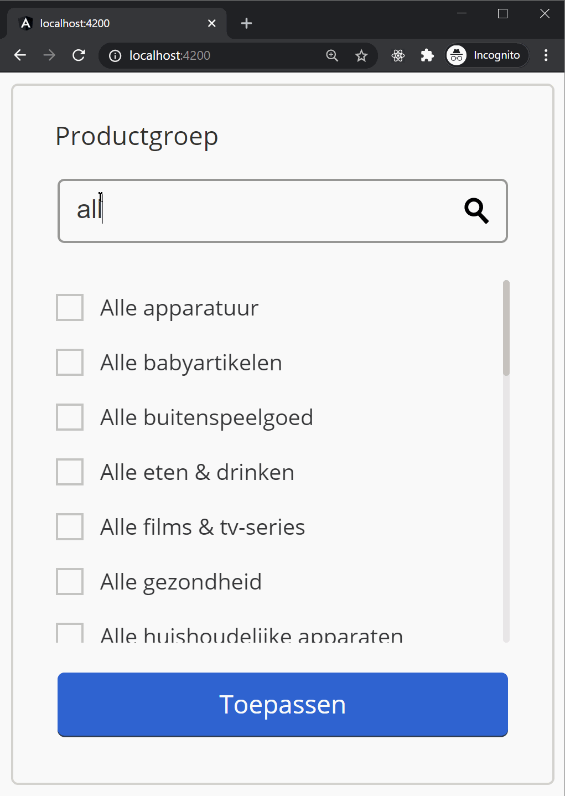

# Technical assignment for Bol.com

## Assignment:

Setup a webapp which a multiple-select-filter.

## Requirements:

- Show the multi-select and fill it with the given JSON data using http
- Create a search which can filter the JSON data
- Make it possible to select multiple items
- Selected items need to be ordered on top, also they should not be affected by the search filter
- BONUS: store the selected items locally. They should persist after page reload.

## Demo

## Scripts:

- Run `ng serve` for a dev server. Navigate to `http://localhost:4200/`.
- Run `ng test` to execute the unit tests via [Karma](https://karma-runner.github.io).
- Run `ng e2e` to execute the end-to-end tests via [Protractor](http://www.protractortest.org/).
